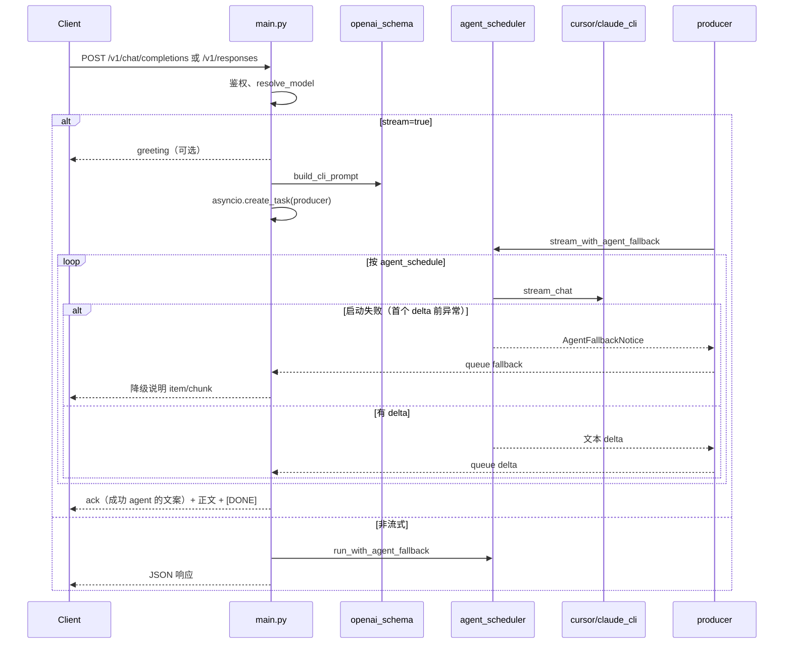

# cursor-wrapper 架构与运行逻辑

本文档描述当前代码结构、请求处理顺序，以及多 Agent（Claude / Cursor）调度与降级设计。

## 1. 目录与模块

| 路径 | 职责 |
|------|------|
| `app/main.py` | FastAPI 入口：`/healthz`、`/v1/models`、`/v1/chat/completions`、`/v1/responses` |
| `app/config.py` / `app/config.bak.py` | 运行时配置（成对维护） |
| `app/cursor_cli.py` | Cursor Agent CLI 子进程与 NDJSON 解析 |
| `app/claude_cli.py` | Claude Code CLI 子进程与 NDJSON 解析 |
| `app/cli_base.py` | 共享 `CLIError`、可执行文件解析、NDJSON 行迭代 |
| `app/agent_scheduler.py` | 按 `agent_schedule` 顺序调度，启动失败时降级 |
| `app/openai_schema.py` | OpenAI 请求/响应模型与 SSE 事件构造 |
| `app/stream_timeout.py` | 流式空闲超时、ACK 强制计时 |
| `app/stream_chat_session.py` | 流式子进程注册与 `terminate` |
| `app/stream_observe.py` | 流式观测日志 |
| `app/sse_frame.py` | SSE `data:` / 注释帧 |
| `app/mock_startup_main.py` | Mock 回放（不调真实 CLI） |

## 2. HTTP → CLI 总流程



## 3. Agent 调度策略

配置项 `CONFIG_AGENT_SCHEDULE` / 环境变量 `AGENT_SCHEDULE`，默认 `claude,cursor`。

- **顺序尝试**：按列表从左到右选用 CLI。
- **仅启动失败降级**：在 `stream_chat` / `run_chat` 抛出异常且**尚未 yield 任何正文**时，视为启动失败，尝试下一个 agent。
- **流中失败**：已产出过 delta 后出错，不再切换 agent，按既有逻辑向客户端返回 `err`。
- **全部失败**：队列 `err`，流式返回 error 事件；非流式 HTTP 502。

降级时向客户端暴露失败原因：

- **Chat 流式**：在切换前推送一条 `content` chunk，内容为 `[{agent}] 启动失败: {message}`。
- **Responses 流式**：为失败 agent 新建完整 `output_item` 生命周期（`added` → `content_part` → `delta` → `output_text.done` → `item.done`），`output_index` 递增，避免与 greeting / ack / 正文 item 冲突。

## 4. 分 Agent ACK 文案

| Agent | 配置常量 | 默认文案 |
|-------|----------|----------|
| `cursor` | `WRAPPER_RESPONSE_ACK_TEXT_CURSOR` | Cursor Agent 已介入… |
| `claude` | `WRAPPER_RESPONSE_ACK_TEXT_CLAUDE` | Claude Agent 已介入… |

`Settings.ack_text_for(agent)` 在首个成功 agent 的首个 delta 前输出 ack；`response_ack_idle_force` 等待期间使用**当前正在尝试**的 agent 对应 ack 文案。

## 5. Cursor CLI 封装要点

命令形态（简化）：

```text
agent -p "<prompt>" --output-format stream-json --stream-partial-output \
  --workspace <dir> [--model <resolved>] [--trust] [--approve-mcps] ...
```

- 环境：`CURSOR_API_KEY` 注入子进程（可选）。
- NDJSON：`assistant` + `timestamp_ms` 为实时 delta；`result` 结束读流。
- 长 prompt（>4000 字符）外置到 `workspace/prompt/`。

## 6. Claude CLI 封装要点

命令形态（简化）：

```text
claude -p "<prompt>" --output-format stream-json \
  --verbose --include-partial-messages [--model <resolved>]
```

- **不**由 wrapper 传入 `ANTHROPIC_AUTH_TOKEN`、`ANTHROPIC_MODEL` 等；鉴权与模型默认值由本机 Claude CLI 配置承担。
- NDJSON：解析 `type=stream_event` 且 `event.type=content_block_delta`、`delta.type=text_delta`；兼容 `type=result` 结束信号。
- 共享 `cli_base` 的可执行文件解析、prompt 外置逻辑。

## 7. Responses 流 `output_index` 规划

动态递增，典型顺序（`agent_schedule=[claude,cursor]`，claude 启动失败）：

| output_index | 内容 |
|--------------|------|
| 0 | greeting（若开启） |
| 1 | claude 启动失败说明 item |
| 2 | ack（cursor 文案，若开启） |
| 3 | cursor 正文 item |

每个降级 item 使用独立 `msg_{uuid}`，并走完 `output_text.done` / `item.done`。

## 8. 配置优先级

`CONFIG_*` 非空 > 环境变量 > 代码默认。`config.py` 与 `config.bak.py` 字段结构必须一致（见 `.cursor/rules/config-parity.mdc`）。

## 9. 测试

`pytest` 使用 `TestClient` + `dependency_overrides` 注入 Fake CLI / 自定义 `Settings`。新增：

- `test_agent_scheduler.py`：启动失败降级、全部失败
- `test_config.py`：`agent_schedule` 解析
- 现有流式测试通过 `agent_schedule=["cursor"]` 保持行为不变
